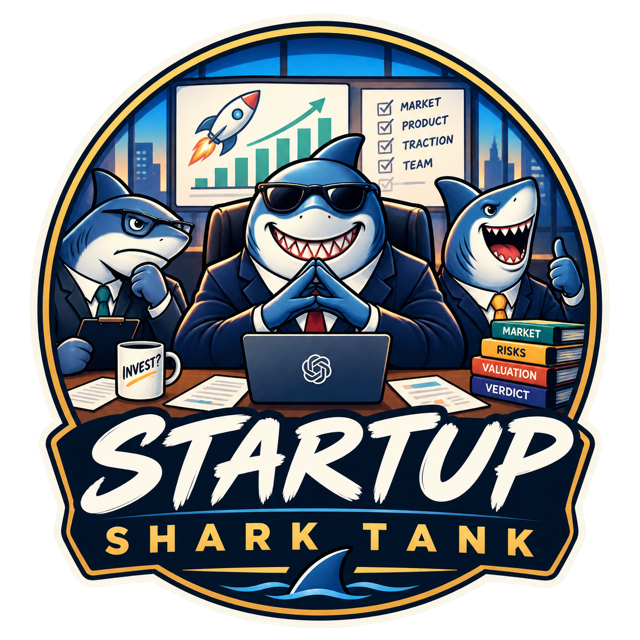
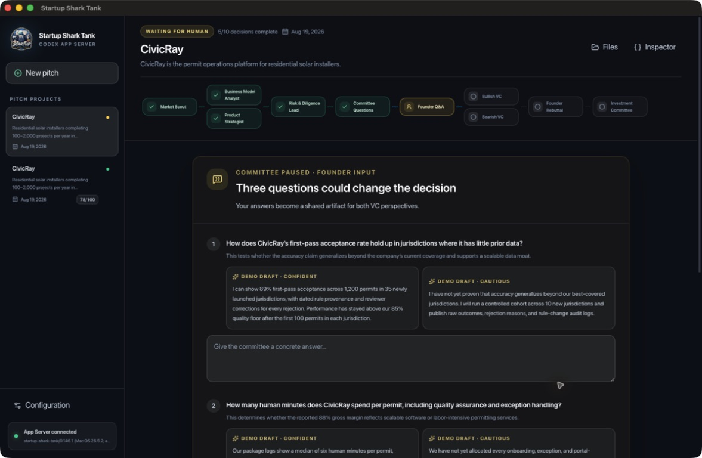
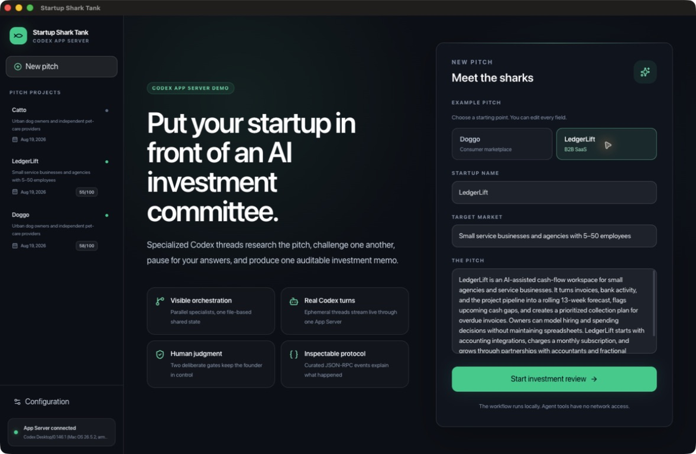
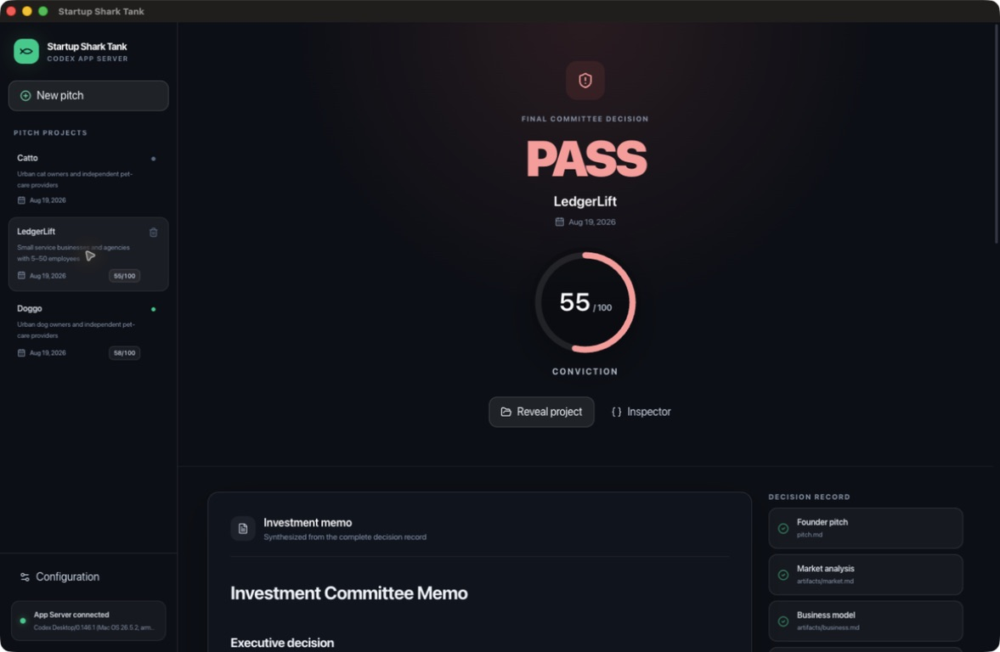
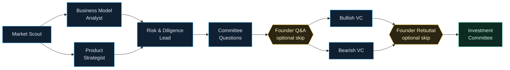
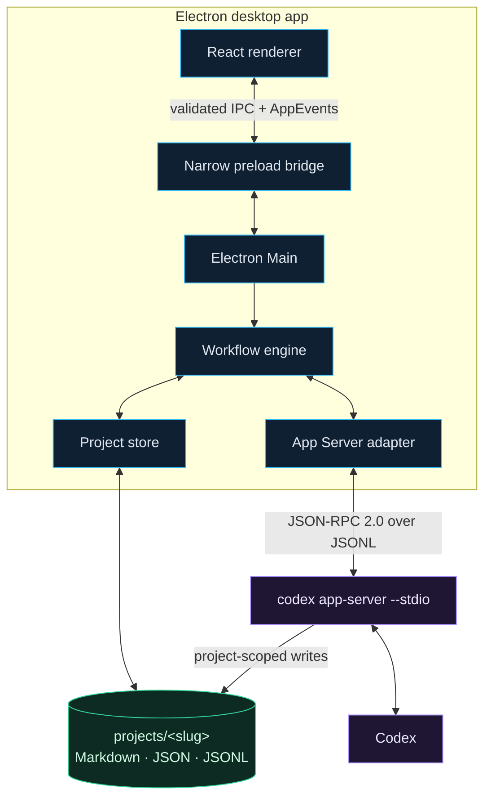
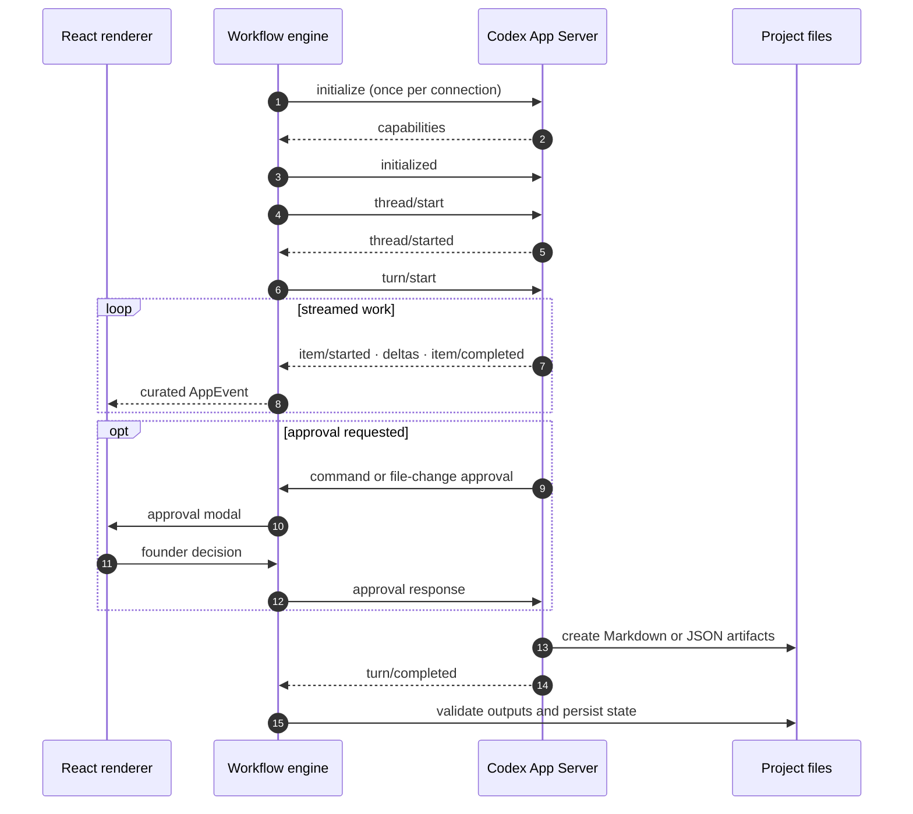

<p align="center">
  
</p>

<h1 align="center">Startup Shark Tank</h1>

<p align="center">
  <strong>A visible multi-agent investment workflow powered by the Codex App Server.</strong>
</p>

<p align="center">
  
  
  
  
  
  <a href="LICENSE"></a>
</p>

Turn a startup pitch into an inspectable **INVEST** or **PASS** decision. Independent Codex agents analyze the opportunity, challenge each other through shared files, pause for founder input, and produce one auditable investment memo.



<table>
  <tr>
    <td width="50%" align="center">
      
      <br><sub><strong>Start with an editable example pitch</strong></sub>
    </td>
    <td width="50%" align="center">
      
      <br><sub><strong>Finish with a complete decision record</strong></sub>
    </td>
  </tr>
</table>

## Quick start

> [!NOTE]
> Startup Shark Tank is currently optimized for local development on macOS. Other platforms are not supported or verified yet.

**Requires:** macOS, Node.js `>=24 <25`, pnpm `11.15.1`, and the [`codex`](https://learn.chatgpt.com/docs) CLI on `PATH`.

```bash
pnpm install
codex login # skip when already signed in
pnpm dev
```

Choose **Doggo** or **LedgerLift**, edit the pitch if desired, and start the investment review.

## Product journey


The app is a workflow dashboard, not a group chat. Every specialist gets a fresh Codex thread; Markdown and JSON artifacts carry evidence between stages.

## Workflow

Ten nodes form eight connected stages. The two analyst pairs run in parallel, while the human gates can be answered or skipped.



The generic engine only knows `agent` and `human-input` nodes. The graph lives in [`workflows/shark-tank.yaml`](workflows/shark-tank.yaml); specialist instructions live in [`agents/shark-tank`](agents/shark-tank).

## Architecture



The Renderer has no Node.js or arbitrary filesystem access. Electron Main owns the canonical workflow state, validates all paths, and runs one long-lived App Server process for every specialist.

## Why Codex App Server?

The [Codex App Server](https://learn.chatgpt.com/docs/app-server) is the interface Codex uses for rich clients. It exposes authentication, threads, turns, approvals, interrupts, and streamed agent events through bidirectional JSON-RPC; the default stdio transport is newline-delimited JSON.

That makes it a better fit here than a background job abstraction: the desktop app needs to show live work, route real approvals to the founder, stop active turns, and explain every step in its Developer Inspector. For CI and unattended automation, OpenAI recommends the Codex SDK instead.

<details>
<summary><strong>Follow one agent turn</strong></summary>



The checked-in TypeScript bindings under `src/main/codex/generated/` are generated by the installed CLI and match its protocol version:

```bash
pnpm codex:generate
```

</details>

<details>
<summary><strong>Workflow and model configuration</strong></summary>

The workflow sets a default model and concurrency limit:

```yaml
defaults:
  model: gpt-5.6-terra
  maxParallelAgents: 2
```

An agent can override the model in its Markdown frontmatter:

```yaml
---
model: gpt-5.6-sol
---
```

The read-only **Configuration** dialog shows the workflow, dependencies, effective model for every agent, available Codex models, expected outputs, and complete agent instructions.

</details>

<details>
<summary><strong>Files, persistence, and recovery</strong></summary>

```text
projects/<slug>/
├── project.json
├── pitch.md
├── artifacts/*.md
├── committee/questions.json
├── committee/questions.md
├── human/*.md
├── investment-memo.md
└── .sharktank/
    ├── workflow-state.json
    └── runs/<runId>/events.jsonl
```

- State changes are atomic; persisted events are redacted.
- Completed nodes and human input survive an app restart. Previously running nodes become resumable interruptions.
- Agent tools can write only inside the pitch project and cannot access the network.
- Web search and Codex internal subagents are disabled so the visible orchestration belongs entirely to this app.
- Stopped, waiting, failed, and completed pitches can be moved to the macOS Trash. Active runs must be stopped first.

</details>

<details>
<summary><strong>Manual verification and intentional limits</strong></summary>

This demo intentionally contains no automated test framework, mocks, fixtures, or test configuration. Its local quality gate is:

```bash
pnpm lint
pnpm typecheck
pnpm build
git diff --check
```

For a full walkthrough, complete a LedgerLift run, use or edit a generated founder-answer draft, exercise Stop and Resume, inspect both parallel phases, and confirm the final memo and score in the sidebar.

This is a local macOS development demo, not a signed distribution. It intentionally has no database, cloud queue, custom login flow, generic form builder, protocol playground, or synthetic approval probe.

</details>

## Support

Enjoying Startup Shark Tank or finding it useful? If you would like to support future experiments around Codex and agent workflows, a coffee is always appreciated. Thank you! ☕

<a href="https://buymeacoffee.com/phillippbertram">    </a>

## License

Released under the [MIT License](LICENSE).

Official references: [Codex documentation](https://learn.chatgpt.com/docs) · [Codex App Server](https://learn.chatgpt.com/docs/app-server)
