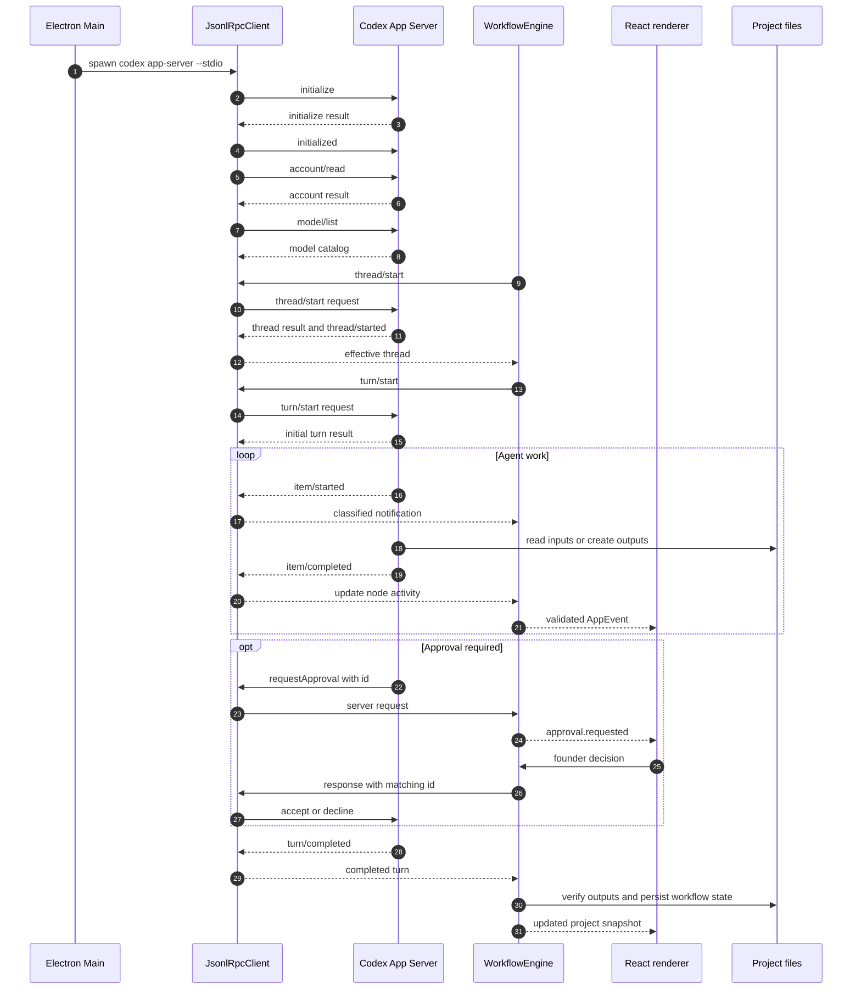
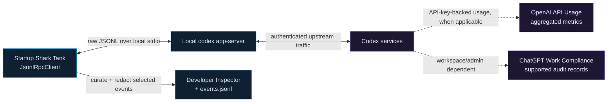

# Codex App Server in Startup Shark Tank

This document explains how Startup Shark Tank uses the Codex App Server. It is intentionally
project-specific: it describes the messages this application sends or handles, the configuration
choices it makes, and the lifecycle of one workflow agent. It is not a complete catalog of every
method exposed by every Codex CLI version.

The short version is:

- Electron Main starts one long-lived local `codex app-server` child process.
- The app and server exchange bidirectional JSON-RPC-style messages over stdin and stdout.
- The app creates a separate ephemeral Codex thread for every visible workflow agent.
- The app, rather than Codex-internal subagents, owns orchestration, concurrency, persistence, and
  the user-facing timeline.

## Where the integration lives

| Responsibility | Source |
| --- | --- |
| Find and start the Codex CLI, perform the handshake, and expose typed operations | [`CodexAppServer.ts`](../../src/main/codex/CodexAppServer.ts) |
| Frame JSONL messages, correlate request IDs, and classify incoming messages | [`JsonlRpcClient.ts`](../../src/main/codex/JsonlRpcClient.ts) |
| Create threads and turns, handle events and approvals, and update workflow state | [`WorkflowEngine.ts`](../../src/main/workflow/WorkflowEngine.ts) |
| Describe the protocol version provided by the installed Codex CLI | [`generated/`](../../src/main/codex/generated/) |
| Declare the visible application-level workflow and its concurrency limit | [`shark-tank.yaml`](../../workflows/shark-tank.yaml) |

For the scheduler, state machine, human gates, recovery behavior, and Web Search policy, see
[Workflow Engine in Startup Shark Tank](../workflow-engine/README.md).

The React renderer never talks to the App Server directly. Electron Main owns the process and
workflow state; the renderer receives a smaller set of validated application events over Electron
IPC.

## Protocol and message shapes

The App Server protocol is bidirectional JSON-RPC 2.0 with one important wire-level difference:
the `"jsonrpc": "2.0"` member is omitted. With stdio, each complete JSON message occupies one line
of stdout or stdin, commonly called JSONL or newline-delimited JSON.

Startup Shark Tank handles five message roles.

### 1. Client request

The client sends a method, parameters, and an ID. `JsonlRpcClient` allocates increasing numeric IDs
and waits up to 15 seconds for the matching response by default.

```json
{
  "id": 1,
  "method": "account/read",
  "params": { "refreshToken": false }
}
```

### 2. Server response

The server echoes the request ID and returns either `result` or `error`. It does not include a
method.

```json
{
  "id": 1,
  "result": { "account": { "type": "chatgpt" } }
}
```

```json
{
  "id": 1,
  "error": { "code": -32602, "message": "Invalid params" }
}
```

### 3. Client notification

A notification has a method but no ID, so the sender does not wait for a response. The required
`initialized` acknowledgement is the client notification used by this project.

```json
{ "method": "initialized" }
```

### 4. Server notification

Server notifications also omit the ID. They form the event stream for thread, turn, and item
progress.

```json
{
  "method": "item/started",
  "params": {
    "threadId": "thr_123",
    "turnId": "turn_456",
    "item": { "id": "item_789", "type": "reasoning" }
  }
}
```

### 5. Server request and client response

The server can also initiate a request. The presence of both `method` and `id` distinguishes it
from a notification. Startup Shark Tank uses this flow for command and file-change approvals.

```json
{
  "id": 44,
  "method": "item/commandExecution/requestApproval",
  "params": {
    "threadId": "thr_123",
    "turnId": "turn_456",
    "reason": "Create the requested report"
  }
}
```

The client answers with the same response envelope used by the server:

```json
{
  "id": 44,
  "result": { "decision": "accept" }
}
```

`JsonlRpcClient` classifies incoming messages using only these fields:

- `id` without `method`: response to an earlier client request.
- `method` with `id`: request initiated by the server.
- `method` without `id`: server notification.

Non-JSON stdout is ignored and reported through the diagnostic stderr event. The child process's
actual stderr is read separately and never treated as protocol traffic.

## Connection startup and initialization

Electron starts the child process with arguments equivalent to:

```bash
codex app-server --stdio \
  -c agents.enabled=false \
  -c 'mcp_servers={}'
```

The implementation passes these as separate process arguments without invoking a shell. `--stdio`
is equivalent to `--listen stdio://`, which is the App Server's default transport.

Immediately after the process starts, the client must complete the connection-level handshake. No
thread or turn request is valid before it.

### `initialize`

Startup Shark Tank sends:

```json
{
  "id": 1,
  "method": "initialize",
  "params": {
    "clientInfo": {
      "name": "startup-shark-tank",
      "title": "Startup Shark Tank",
      "version": "0.1.0"
    },
    "capabilities": {
      "experimentalApi": false,
      "requestAttestation": false
    }
  }
}
```

`clientInfo` identifies the integration:

- `name` is the stable machine-readable client identity, including for OpenAI compliance logs.
- `title` is the human-readable product name.
- `version` is the integration version reported by this client.

The capability flags describe what this client is prepared to handle:

- `experimentalApi: false` keeps the connection on the stable protocol surface. Experimental
  methods or fields are rejected instead of silently becoming available.
- `requestAttestation: false` means the client does not opt into server-initiated
  `attestation/generate` requests.

Other current capability fields, such as notification opt-outs and extended MCP form elicitation,
are deliberately omitted because this client does not implement those features.

The response contains the App Server's upstream user-agent string, Codex home path, platform
family, and operating system:

```json
{
  "id": 1,
  "result": {
    "userAgent": "...",
    "codexHome": "/absolute/path/to/.codex",
    "platformFamily": "unix",
    "platformOs": "macos"
  }
}
```

The application currently surfaces `userAgent` in its Codex status. The other fields remain part of
the typed response for future platform-aware behavior.

### `initialized`, account, and models

After receiving the response, the client sends the `initialized` notification. It then makes two
ordinary requests:

1. `account/read` with `refreshToken: false` verifies that the CLI already has a signed-in account.
2. `model/list` with `limit: 50` and `includeHidden: false` populates the model choices shown by the
   app. Failure to load this optional catalog does not make the entire connection fail.

Authentication is therefore owned by the installed Codex CLI. The app does not implement a second
login or token store; it asks the user to run `codex login` when no account is available.

## Threads, turns, and items

The protocol uses three nested concepts:

| Concept | Meaning in the App Server | Meaning in Startup Shark Tank |
| --- | --- | --- |
| **Thread** | A conversation and its accumulated model context | One isolated specialist invocation, such as Market Scout or Bullish VC |
| **Turn** | One user request plus all agent work caused by it | The request to read the node's inputs and create its expected outputs |
| **Item** | One unit of input, work, or output inside a turn | Reasoning, command execution, file change, Web Search, or agent message shown in the timeline |

This is not a group-chat implementation. The visible "multi-agent" experience is an application
workflow:

- Every agent node gets a fresh thread.
- Independent nodes may run concurrently, up to the workflow's `maxParallelAgents` limit.
- Agents do not share a Codex thread or hidden conversation context.
- Markdown and JSON artifacts in the pitch project carry evidence to downstream nodes.
- Human gates add founder answers or rebuttals to those shared project files.

The adapter currently exposes `thread/start`, not `thread/resume` or `thread/fork`. Threads are
created with `ephemeral: true`; durable workflow state, artifacts, and redacted inspector events are
owned by the application.

## Starting one conversation

Once the connection handshake is complete, `WorkflowEngine` starts a conversation for a workflow
node in two steps.

### 1. Create the thread with `thread/start`

A representative request looks like this:

```json
{
  "id": 4,
  "method": "thread/start",
  "params": {
    "model": "gpt-5.6-terra",
    "cwd": "/absolute/path/to/projects/civicray",
    "approvalPolicy": "on-request",
    "approvalsReviewer": "user",
    "sandbox": "workspace-write",
    "config": {
      "web_search": "cached",
      "tools": {
        "web_search": { "context_size": "medium" }
      }
    },
    "baseInstructions": "Project-wide safety and tool boundaries...",
    "developerInstructions": "Instructions for this specialist...",
    "serviceName": "startup-shark-tank",
    "ephemeral": true
  }
}
```

The model comes from the workflow default unless the agent definition overrides it. The working
directory is the selected pitch project. Base instructions define common boundaries; developer
instructions contain the specialist role loaded from `agents/shark-tank/`.

Web Search is a per-thread choice in the current application state:

- Selected, allowlisted research nodes receive Cached or Live built-in Web Search.
- Other nodes receive `web_search: "disabled"` and `tools.web_search: false`.
- This setting does not grant shell commands network access.

The response returns the created thread and its effective model settings. The server also emits a
`thread/started` notification. The response is the authoritative source used to obtain the thread
ID before the turn is sent.

### 2. Add work with `turn/start`

The thread itself does not perform analysis until the client starts a turn:

```json
{
  "id": 5,
  "method": "turn/start",
  "params": {
    "threadId": "thr_123",
    "input": [
      {
        "type": "text",
        "text": "Read the project inputs and create the declared outputs.",
        "text_elements": []
      }
    ],
    "cwd": "/absolute/path/to/projects/civicray",
    "approvalPolicy": "on-request",
    "approvalsReviewer": "user",
    "sandboxPolicy": {
      "type": "workspaceWrite",
      "writableRoots": ["/absolute/path/to/projects/civicray"],
      "networkAccess": false,
      "excludeTmpdirEnvVar": false,
      "excludeSlashTmp": false
    }
  }
}
```

The turn repeats the important execution boundaries explicitly. In particular, only the pitch
project is writable and shell network access remains disabled. The Committee Questions node also
passes an `outputSchema` so that its final agent message must be valid structured JSON.

`turn/start` responds immediately with the initial turn object. Work then continues asynchronously
through notifications until `turn/completed` reports the terminal status.

## End-to-end sequence



If the user stops a running workflow, the engine sends `turn/interrupt` for each active node that
has both a thread ID and turn ID. A successful request is acknowledged with an empty result; the
turn ultimately completes with an interrupted status.

## Messages used by this project

### Client-initiated messages

| Method | Kind | Purpose in this project |
| --- | --- | --- |
| `initialize` | Request | Identify the client and negotiate connection capabilities |
| `initialized` | Notification | Confirm that the client accepted the initialization result |
| `account/read` | Request | Check whether the installed CLI has an authenticated account |
| `model/list` | Request | Load visible models and their supported reasoning efforts |
| `thread/start` | Request | Create one ephemeral conversation for one workflow agent |
| `turn/start` | Request | Send the node prompt and execution policy to that thread |
| `turn/interrupt` | Request | Cancel an active node when the workflow is stopped |

### Server notifications consumed by the workflow

| Method | Project behavior |
| --- | --- |
| `thread/started` | Accepted for the curated inspector stream when it can be associated with an active node; the thread response also produces the app's thread-start record |
| `turn/started` | Accepted for the curated inspector stream; the `turn/start` response supplies the turn ID used by the workflow |
| `item/started` | Updates the node's visible activity and records a redacted inspector event |
| `item/completed` | Updates activity, records the event, and captures completed agent messages; Web Search events retain only selected metadata and domains |
| `turn/completed` | Resolves the node's pending completion and supplies the final turn status and items |
| `error` | Rejects the active node with the server-provided error message |

The low-level client can parse any notification envelope, but `WorkflowEngine` intentionally
curates only the methods above. Delta notifications such as `item/agentMessage/delta` or reasoning
deltas are not currently forwarded to the renderer. A `webSearch` is not a separate method in this
application; it is an item type carried by `item/started` and `item/completed`.

### Server-initiated approval requests

The workflow accepts the current approval methods:

- `item/commandExecution/requestApproval`
- `item/fileChange/requestApproval`

It also accepts the legacy names `execCommandApproval` and `applyPatchApproval` for compatibility
with older protocol versions. The request is converted into an application approval with one of
three decisions:

- `accept`
- `acceptForSession`
- `decline`

The founder's decision is returned using the original protocol request ID. Unknown server request
methods receive a JSON-RPC `method not found` error instead of being ignored.

## Why `agents.enabled=false`?

The official Codex configuration reference defines `agents.enabled` as the switch for Codex
multi-agent tools. Setting it to `false` does **not** prevent Startup Shark Tank from running
multiple visible specialists. It prevents an individual Codex thread from spawning additional
Codex-managed subagents.

That distinction is central to the demo:

| Application-level agents | Codex-internal subagents |
| --- | --- |
| Declared in the Shark Tank workflow | Chosen dynamically by a model inside a thread |
| One visible workflow node maps to one thread | Additional child threads could appear beneath that thread |
| Concurrency is limited by `maxParallelAgents` | Concurrency would also depend on Codex's subagent limits |
| Inputs and outputs are explicit project artifacts | Context and results would flow through the internal agent protocol |
| State, retries, approvals, and timing are shown in the app | Some orchestration would happen outside the app's workflow model |

Disabling internal subagents therefore keeps the behavior inspectable and preserves the invariant:

> One visible workflow agent equals one Codex thread controlled by the application.

It also avoids hidden parallelism, unplanned child threads, and work that the workflow engine cannot
attribute to a declared node. The model instructions reinforce the same boundary by telling each
specialist not to use subagents.

The adjacent `mcp_servers={}` override serves a similar purpose for integrations: user-configured
MCP servers are not inherited by this dedicated App Server process. Built-in Web Search is handled
separately through an explicit per-thread configuration for allowlisted research nodes.

## Why stdio instead of WebSocket?

stdio is not a one-way or batch transport here. The child process has three pipes:

- Electron writes requests, notifications, and responses to the child's stdin.
- Electron reads responses, notifications, and requests from the child's stdout.
- Electron reads diagnostics from the child's stderr.

This gives the application the same bidirectional protocol semantics it would have over a
WebSocket, with JSON lines providing message boundaries.

stdio fits the ownership model of this desktop app:

- The App Server runs on the same machine and is launched by Electron.
- Its lifetime naturally follows the parent application.
- No TCP port must be selected, exposed, or discovered.
- No listener authentication, TLS, origin policy, or local firewall handling is required.
- There is no separate remote connection to reconnect after a network interruption.
- Process startup failures and exits are directly observable by the parent.

WebSocket support is useful when the client and App Server must run in different processes or on
different machines, such as a remote terminal UI. However, the official App Server documentation
currently labels the WebSocket transport experimental and unsupported. A remote deployment would
also need an authenticated `wss://` listener, secret handling, reconnection behavior, and overload
retries. None of that complexity provides a benefit for the current local child-process design.

If this application later moves the App Server to a separate host, WebSocket or the supported Unix
socket transport can be reconsidered. The JSON-RPC methods would remain conceptually the same; the
framing, connection lifecycle, authentication, and failure handling would change.

## Where can the communication be inspected?

There are three distinct things that are easy to confuse:

1. The local JSON-RPC/JSONL protocol between Startup Shark Tank and `codex app-server`.
2. The authenticated service requests that the App Server makes upstream.
3. Usage, analytics, or compliance records exposed by OpenAI web and admin surfaces.

They are related, but they are not the same log stream.



### Local project views

| View | Content | Important boundary |
| --- | --- | --- |
| Developer Inspector | Curated client, server, and workflow events associated with a workflow node, including thread/turn IDs, item lifecycle, approvals, and Web Search metadata | It is an explanatory lifecycle view, not a protocol sniffer |
| `.sharktank/runs/<runId>/events.jsonl` | Persistent source for the Inspector; sensitive keys and bearer values are redacted before writing | It stores selected events, not every request, response, notification, or streaming delta |
| Main-process development console | App Server stderr diagnostics and process failures | stderr is deliberately separate from the JSONL protocol on stdout |
| This guide and generated types | The actual message shapes used by the application and the broader CLI-version-specific protocol | They describe possible traffic but do not record a particular run |

The application currently has no full wire-capture mode. Adding one would require explicit
instrumentation around `JsonlRpcClient.write()` and `handleLine()`. Such a trace could contain full
prompts, model output, commands, file paths, and artifact content, so it should not be added as an
always-on log or persisted without a stricter privacy design.

### OpenAI web and administration views

Startup Shark Tank does not own a separate login flow. After the handshake it calls `account/read`
and reuses the account already active in the installed Codex CLI. The App Server supports multiple
authentication modes, including an OpenAI API key and a managed ChatGPT login. The application only
checks whether an account exists; it neither selects an OpenAI Platform project nor records the
credential type in its Inspector.

This leads to different observability depending on the active account:

| Surface | When it is relevant | What to expect |
| --- | --- | --- |
| [OpenAI API Usage and Costs](https://platform.openai.com/docs/api-reference/usage) | The active Codex account is backed by an OpenAI API key associated with an API organization | Aggregated request, token, and cost information grouped by fields such as project, API key, user, or model; not the App Server's local JSONL frames |
| ChatGPT account/workspace surfaces | The active Codex account uses managed ChatGPT authentication | Account- or workspace-level Codex usage may be available according to the plan, but the normal API Platform is not a local App Server transcript viewer |
| [ChatGPT Work Compliance API](https://learn.chatgpt.com/docs/enterprise/compliance-api) | An eligible workspace and authorized administrator need auditable records for security, legal, governance, or investigation workflows | Supported Codex compliance records that can be exported and correlated with other systems; not a byte-for-byte wire capture |

The [official App Server documentation](https://learn.chatgpt.com/docs/app-server) specifically says
that `clientInfo.name` identifies an integration for the OpenAI Compliance Logs Platform. This
project sends `startup-shark-tank`, so supported compliance records can attribute the client when
the workspace has that capability. OpenAI also asks developers of new enterprise integrations to
contact OpenAI about adding their client to the known-clients list.

For this project, the practical debugging order is therefore:

1. Use the Developer Inspector to understand the active node's thread, turn, items, approvals, and
   research activity.
2. Inspect the run's `events.jsonl` when a persistent, secret-redacted event history is needed.
3. Check App Server stderr in the development console for startup, protocol parsing, or process
   failures.
4. Use OpenAI usage or compliance surfaces only for their intended aggregation, billing, or
   governance questions, not as a replacement for a local protocol trace.

## Configuration scopes

It helps to distinguish the four places where this project supplies information:

| Scope | Lifetime | Examples |
| --- | --- | --- |
| Process configuration | Whole App Server process | `agents.enabled=false`, empty `mcp_servers` |
| Connection initialization | One stdio connection | `clientInfo`, `experimentalApi`, `requestAttestation` |
| Thread configuration | One workflow agent | Model, working directory, instructions, Web Search mode, `ephemeral` |
| Turn configuration | One request in that thread | User input, writable root, network policy, approvals, optional output schema |

This layering explains why client capabilities do not contain the model, sandbox, or prompt. Client
capabilities describe what the integration can support. Thread and turn parameters describe what a
particular conversation is allowed and expected to do.

## Generated protocol types

The checked-in TypeScript files under [`src/main/codex/generated/`](../../src/main/codex/generated/)
are generated by the installed Codex CLI:

```bash
pnpm codex:generate
```

The output is specific to that CLI version and should not be edited manually. Useful entry points
for exploring the broader protocol are:

- [`ClientRequest.ts`](../../src/main/codex/generated/ClientRequest.ts) for methods a client can
  call.
- [`ServerNotificationEnvelope.ts`](../../src/main/codex/generated/ServerNotificationEnvelope.ts)
  for the full notification union.
- [`ServerRequest.ts`](../../src/main/codex/generated/ServerRequest.ts) for requests initiated by
  the server.
- [`ThreadStartParams.ts`](../../src/main/codex/generated/v2/ThreadStartParams.ts) and
  [`TurnStartParams.ts`](../../src/main/codex/generated/v2/TurnStartParams.ts) for the main
  conversation inputs used here.

Regenerate these bindings after intentionally changing the required Codex CLI version, then review
the resulting diff and update this document only where the application's actual integration has
changed.

## Official references

- [Codex App Server](https://learn.chatgpt.com/docs/app-server): protocol, lifecycle, transports,
  methods, events, approvals, authentication modes, and compliance client identification.
- [Codex configuration reference](https://learn.chatgpt.com/docs/config-file/config-reference):
  configuration keys including `agents.enabled`.
- [OpenAI API Usage](https://platform.openai.com/docs/api-reference/usage): aggregated API request,
  token, and cost dimensions.
- [ChatGPT Work Compliance API](https://learn.chatgpt.com/docs/enterprise/compliance-api): the
  administration boundary and intended governance use cases for auditable records.
